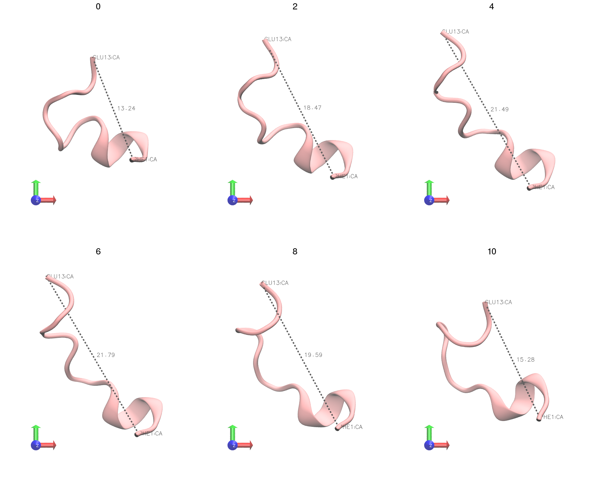

# Biomolecule Tile Rendering

Sometimes one needs to explain the dynamic behaviour of a molecule without showing a video. In this cases showing snapshots at different moments of your trajectory could be the solution. This script will automatize the work of generating this kind of images:  



This script will invoke VMD to render the picture, and image magick to do the tle composition. This means you need to have both installed and accessible if you want to use this script out of the box. 

##Parameters
 
* -i: The pdb file with the trajectory.
* -v: The VMD visualization state you want to use. If it is not specified, it uses VMDs initial representation.
* -o: The output tiled image with all renders.
* -f: The number of frames of the trajectory one wants to extract. For instance, if a trajectory contains 10 frames and we specify we want 5, it will extract frames 0,2,4,6 and 8. If not provided, it will use all frames.
* -s: The grid dimensions for the tiled image as 'number_of_rows,number_of_columns'.     

The example was generated using:
```bash 
> python /home/user/git/PhD-VMDSnapshotTiles/take_snapshots.py -i test.pdb -v visual.vmd -s 3,2 -f 6 -o output.png
```
